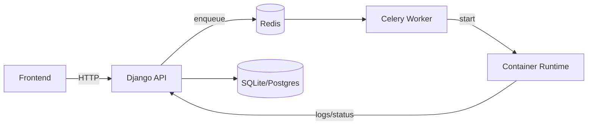

# Analytic Eyes

Analytic Eyes é uma plataforma para gerenciar, orquestrar e executar pipelines ETL com foco em:

- isolamento seguro de execução (containers);
- agendamento e execução assíncrona via Celery;
- controle de permissões por pipeline (owner/colaborador);
- interface web para gerenciamento e API REST para automação.

O repositório contém o manager (API + frontend), repositório de ETLs e exemplos.

---

## Índice

- [Visão geral](#visão-geral)
- [Recursos](#recursos)
- [Stack tecnológica](#stack-tecnologica)
- [Arquitetura (resumo)](#arquitetura-resumo)
- [Rotas principais da API](#rotas-principais-da-api)
- [Executando localmente (quickstart)](#executando-localmente-quickstart)
- [Desenvolvimento e testes](#desenvolvimento-e-testes)
- [Variáveis de ambiente importantes](#variaveis-de-ambiente-importantes)
- [Deploy / Produção (resumo)](#deploy--produção-resumo)
- [Contribuição](#contribuição)
- [Licença](#licença)

---

## Visão geral

O objetivo do Analytic Eyes é permitir que times criem, compartilhem e executem pipelines ETL escritas em Python com dependências específicas, garantindo isolamento entre execuções e rastreabilidade dos runs.

Casos de uso típicos:

- consolidação diária de dados;
- ingestão e transformação via scripts customizados;
- encadeamento de pipelines (triggers entre pipelines);
- execução on-demand para análises ad-hoc.

---

## Recursos

- Criação, edição, exclusão e execução de pipelines.
- Upload/edição do código `main.py`, `requirements.txt` e `.env` por pipeline.
- Agendamento recorrente (dias/horário) via Celery Beat.
- Histórico de execuções (runs) com logs vinculados.
- Controle de acesso por pipeline (view / execute / edit / owner).
- Execução isolada em container Docker para cada run.

---

## Stack tecnológica

- Backend: Django + Django REST Framework (`etl-manager/backend`)
- Frontend: React + Vite (`etl-manager/frontend`)
- Execução: Docker + Celery (Redis como broker)
- Runner / exemplos: `etls/` (ex.: `etls/etl_vendas`)

---

## Arquitetura (resumo)

1. O usuário aciona a API (UI ou client).
2. A API grava o run e enfileira a tarefa no Redis.
3. Celery Worker puxa a tarefa e inicializa um container para executar a pipeline.
4. Logs e status são persistidos e expostos via API.

Diagrama (visão lógica):



---

## Rotas principais da API

Base local: `http://localhost:8000/api/`

Autenticação

- `POST /api/auth/login/` — login, retorna token
- `GET /api/auth/me/` — dados do usuário autenticado

Pipelines

- `GET /api/pipelines/` — lista pipelines visíveis ao usuário
- `POST /api/pipelines/create/` — cria nova pipeline
- `GET /api/pipelines/{id}/details/` — detalhes da pipeline
- `PUT/PATCH /api/pipelines/{id}/update/` — atualiza metadados/código/colaboradores
- `POST /api/pipelines/{id}/` — dispara execução assíncrona da pipeline
- `POST/DELETE /api/pipelines/{id}/delete/` — exclui pipeline (confirmação)
- `GET /api/pipelines/{id}/runs/` — histórico de execuções (runs)
- `GET/POST /api/pipelines/{id}/env/` — consultar/substituir `.env`

Infra / suporte

- `GET /api/health/` — health check

Observação: os paths e payloads completos estão definidos em [etl-manager/backend/config/urls.py](etl-manager/backend/config/urls.py) e nas views relacionadas.

---

## Executando localmente (quickstart)

Recomendado: Docker Compose (integra backend, frontend, redis, workers).

```bash
cd etl-manager
docker compose -f docker-compose-dev.yml up --build
```

Acessos locais:

- Frontend: http://localhost:5173
- Backend / API: http://localhost:8000
- Swagger: http://localhost:8000/api/docs/

Se preferir executar apenas o backend localmente:

```bash
cd etl-manager/backend
python -m venv .venv
. .venv/Scripts/activate   # Windows: .venv\Scripts\activate
pip install -r requirements.txt
python manage.py migrate
python manage.py createsuperuser
python manage.py runserver
```

Para o frontend isolado:

```bash
cd etl-manager/frontend
npm install
npm run dev
```

---

## Desenvolvimento e testes

Executar os testes do backend:

```bash
cd etl-manager/backend
. .venv/Scripts/activate
pip install -r requirements.txt
python manage.py test
```

Logs do Celery e workers são exibidos nos serviços `worker` do Docker Compose.

---

## Variáveis de ambiente importantes

- `DJANGO_SECRET_KEY` — segredo do Django (não versionar)
- `DATABASE_URL` — string de conexão (quando usar Postgres/RDS)
- `REDIS_URL` — URL do Redis para Celery
- `ALLOWED_HOSTS`, `CORS_ALLOWED_ORIGINS`

Coloque essas variáveis em arquivos `.env` locais ou no gerenciador de secrets do ambiente.

---

## Deploy / Produção (resumo)

Evite usando o `docker-compose-dev.yml` em produção. Recomendações:

- build e push das imagens para registry (ECR/GCR/DockerHub);
- orquestração com Kubernetes (EKS/GKE) ou serviços gerenciados;
- usar RDS/Aurora para banco em produção;
- armazenar artefatos e logs em S3/Blob e usar solução de observabilidade (Prometheus/Grafana, ELK/Cloud logging);
- gerenciar segredos com Secret Manager / Vault / ExternalSecrets.

---

## Contribuição

1. Abra uma issue descrevendo a proposta.
2. Abra um branch com prefixo `feature/` ou `fix/`.
3. Adicione testes quando aplicável e siga o padrão do projeto.

Obrigado por contribuir — mantenha PRs pequenos e com descrição clara.

---

## Licença

Este projeto está licenciado conforme o arquivo [LICENSE](LICENSE).

---

## Contato

Abra uma issue para dúvidas, bugs ou propostas de melhoria.
